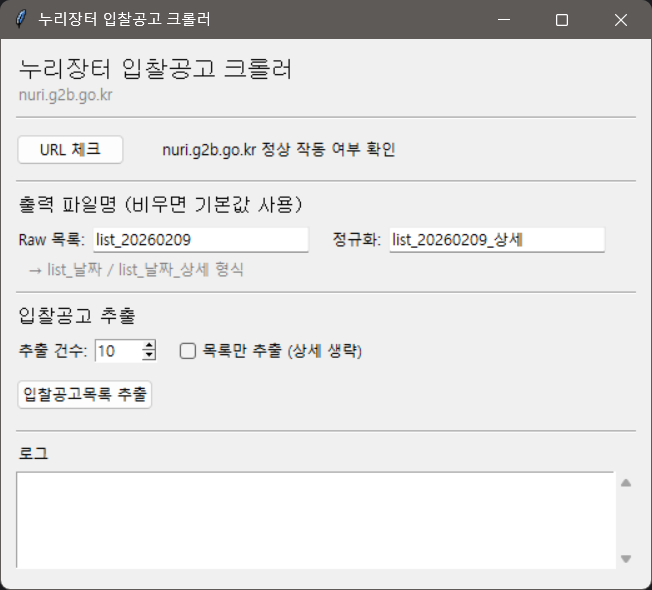

## 누리장터 입찰공고 크롤러

누리장터(`nuri.g2b.go.kr`) 입찰공고 목록/상세를 크롤링하여  
JSON Lines 형식(`.jsonl`)으로 저장하는 크롤러입니다.  
단발 실행용 **CLI / Tkinter UI**와, 지속 운영을 위한 **interval 모드**,  
그리고 상태 기반 **재시작(resume)** 기능을 제공합니다.

---

### 주요 기능

- **입찰공고 목록 수집**
  - 누리장터 입찰공고 목록 페이지에서 공고 번호/제목/기관/마감일시 등 추출
  - `data/raw/list_YYYYMMDD_*.jsonl` 형태로 저장

- **상세 페이지 수집 및 정규화**
  - 각 공고의 상세 페이지에 진입하여 테이블/필드를 파싱
  - `data/normalized/list_YYYYMMDD_상세*.jsonl` 형태로 저장
  - `src/models.py`의 `ListItem` / `NoticeRecord` 모델 기반

- **상태 기반 재시작(Stateful resume)**
  - `src/storage/state.py`의 `StateStore`로 SQLite 상태 DB 관리
  - 이미 처리된 notice_id는 재실행 시 **중복 상세 수집 없이 건너뜀**
  - 마지막 페이지 체크포인트(`bid_list.page`)를 저장하여 **중간 실패 후 이어서 재실행** 가능

- **다양한 실행 모드**
  - CLI:
    - `--mode once`: 한 번 실행 후 종료 (cron/스케줄러 친화적)
    - `--mode interval --interval-min N`: N분 간격 반복 실행
  - Tkinter UI:
    - URL 체크, 결과 로그, 출력 파일명/수집 건수 설정 가능

- **테스트 및 디버깅 지원**
  - `pytest` 기반 단위/통합 테스트
  - `scripts/test_detail.py`로 HTML 파일 또는 live 페이지에 대한 상세 파서 단독 테스트

---

### 기술 스택

- Python 3.12
- [Playwright](https://playwright.dev/python/) (비동기 크롤링)
- [pydantic](https://docs.pydantic.dev/) (데이터 모델링)
- SQLite (`StateStore`) – 상태/체크포인트 저장
- [pytest](https://docs.pytest.org/) – 단위/통합 테스트
- Tkinter – 데스크톱 UI

#### 의존성 / 환경 (예시)

- OS: Windows 11 (개발/테스트 환경)
- Python: 3.12.4
- Python 패키지:
  - playwright: 1.58.0
  - pydantic: 2.12.5
  - pytest: 9.0.2
  - pytest-asyncio: 1.3.0 (통합 테스트용)
  - 그 외: typing-extensions 등 pydantic/pytest가 요구하는 기본 의존성

---

### 디렉터리 구조

```text
crawling/
  app.py                     # Tkinter 기반 데스크톱 UI
  configs/
    default.json             # 크롤링 설정(셀렉터, 컬럼 정의 등)
  data/
    raw/                     # 목록 크롤링 결과(JSONL)
    normalized/              # 상세 크롤링 결과(JSONL)
    errors/                  # 상세 실패 시 HTML/JSON/스크린샷 증거
  src/
    cli.py                   # CLI 진입점 (once / interval 모드)
    crawler/
      nuri.py                # 누리장터 크롤링 핵심 로직
    models.py                # ListItem / NoticeRecord 등 데이터 모델
    storage/
      jsonl.py               # JSON Lines 쓰기 유틸
      state.py               # StateStore (SQLite 상태 DB)
    utils/
      logging.py             # 로깅 설정
      paths.py               # workspace_root, ensure_dir
  state/                     # 실행별 상태 DB (state_*.sqlite)
  tests/
    unit/                    # 단위 테스트 (StateStore 등)
    integration/             # 통합 테스트 (실제 크롤링)
  pytest.ini                 # pytest 설정/마커 정의
```

---

### 설치 및 준비

1. **가상환경 생성 및 활성화 (권장)**

```bash
python -m venv .venv
.venv\Scripts\activate  # Windows PowerShell
```

2. **파이썬 의존성 설치**

프로젝트에 맞는 `requirements.txt`를 만들었다고 가정하고:

```bash
pip install -r requirements.txt
```

Playwright를 처음 사용하는 경우:

```bash
python -m playwright install
```

> 이미 로컬 환경에서 실행 중이라면 위 단계는 한 번만 수행하면 됩니다.

---

### 실행 방법

#### 1) Tkinter UI로 실행

```bash
python app.py
```

UI 사진예시



UI에서:
- **URL 체크**: 현재 누리장터 홈페이지가 정상적으로 작동하는지 체크
- **출력 파일명**: `list_YYYYMMDD` / `list_YYYYMMDD_상세` 기본값 제공, 원하는 이름으로 변경 가능
- **추출 건수**: 1~100 범위 내에서 목록/상세 수집 건수 지정
- **목록만 추출** 체크: 상세 생략하고 목록만 수집
- 로그 창에서 진행 상황과 결과 파일명을 확인할 수 있습니다.

#### 2) CLI로 실행 (once / interval 모드)

```bash
# 한 번만 실행 (cron/스케줄러에서 사용하기 좋은 모드)
python -m src.cli --headed --slowmo-ms 0 --max-pages 2 --max-items 20

# interval 모드: 60분 간격으로 반복 실행
python -m src.cli --mode interval --interval-min 60 --max-items 50

# 목록만 10건만 빠르게 확인 (상세 생략, headless)
python -m src.cli --headless --max-pages 1 --max-items 10 --list-only

# 특정 키워드가 포함된 공고만 수집
python -m src.cli --headless --max-pages 2 --max-items 30 --keyword "재개발" --keyword "설계"

# 디버깅용으로 브라우저를 띄우고 천천히 진행
python -m src.cli --headed --slowmo-ms 500 --max-pages 1 --max-items 5
```

주요 옵션:
- `--headed` / `--headless`: 브라우저 창 표시 여부
- `--slowmo-ms`: 디버깅을 위한 느리게 실행(ms)
- `--max-pages`: 최대 페이지 수
- `--max-items`: 최대 수집 건수
- `--list-only`: 목록만 수집, 상세는 생략

cron 예시(리눅스):

```cron
0 * * * * /path/to/python -m src.cli --mode once --headless --max-items 50 >> /var/log/nuri.log 2>&1
```

---

### 상태 관리 & 재시작 설계

- `src/storage/state.py`의 `StateStore`가 SQLite DB를 관리합니다.
  - `processed` 테이블:
    - `status='seen'`: 목록에서 한 번 본 상태 (상세 수집 전/실패)
    - `status='ok'`: 상세까지 성공적으로 수집 완료
    - `status='error'`: 상세 진입/파싱 실패
  - `checkpoints` 테이블:
    - 예: `key='bid_list.page', value='3'` → 다음 실행 시 3페이지부터 시작
- 실행 시:
  - 목록 수집 단계마다 `mark_seen`으로 공고를 기록
  - 상세 수집 성공 시 `upsert_processed(..., status='ok')`
  - 실패 시 `upsert_processed(..., status='error')` + evidence 저장
- 이를 통해:
  - **중복 상세 수집 방지**
  - **중간 실패 후 같은 state DB로 재실행 시 마지막 지점부터 이어서 수집** 가능

---

### 설계 및 주요 가정

- **설계**
  - 크롤링 핵심 로직(`crawl_once`)은 `src/crawler/nuri.py`에 집중되어 있고,
    - CLI(`src/cli.py`), UI(`app.py`)가 이 함수를 호출하는 형태로 **레이어 분리**를 유지합니다.
  - 상태 관리(`StateStore`)는 별도 모듈(`src/storage/state.py`)로 분리하여
    - 재시작/중복 방지 로직을 **다른 크롤러에서도 재사용 가능**한 형태로 설계했습니다.
  - 셀렉터/컬럼 정의는 `configs/default.json`에 모아 두어,
    - 사이트 구조 변경 시 **코드 수정 없이 설정 변경만으로 대응**하는 것을 목표로 합니다.

- **주요 가정**
  - 누리장터 목록/상세 페이지 구조는 `configs/default.json` 기준과 크게 다르지 않다고 가정합니다.
  - 인증/로그인은 필요하지 않고, 공개 목록만 대상으로 합니다.
  - 한 페이지당 공고 수는 일정하지만, 코드는 **셀렉터 + limit** 기반으로 동작하여
    - 일부 행이 숨겨져 있거나 가상 스크롤이 있어도 `extract_list_items`가 처리하도록 설계했습니다.
  - 네트워크 오류나 상세 파싱 실패는 **개별 공고 단위로 처리**하고,
    - 전체 배치가 중단되지 않고 계속 진행되도록 합니다.

---

### 테스트

#### 단위 테스트

```bash
pytest -m "not integration"
```

- `tests/unit/test_state_store.py`
  - 체크포인트 저장/복원
  - `seen` vs `ok` 상태에 따른 `is_processed` 동작
  - 중단 후 재실행 시 시작 페이지가 체크포인트에서 복원되는지 검증

#### 통합 테스트 (실제 사이트 크롤링)

```bash
pytest -m integration
```

- `tests/integration/test_crawl_happy_path.py`
  - 실제 누리장터에 대해 소량(예: 1페이지, 3건) 크롤링
  - raw/normalized 파일 생성 및 라인 수 검증
- `tests/integration/test_crawl_resume_after_fail.py`
  - `_open_detail`에 의도적인 예외를 주입해 일부 상세 수집 실패 상황을 재현
  - 같은 state DB로 재실행 시 결과가 유지/추가되는지 검증

> 통합 테스트는 네트워크/사이트 변경에 민감할 수 있으므로, 필요 시에만 실행하는 것을 권장합니다.

---

### 디버깅 팁

- **상세 파서만 테스트하고 싶을 때**:

```bash
python scripts/test_detail.py --html "C:/path/to/detail.html"
python scripts/test_detail.py --live --max-items 1 --headed
```

- **페이지네이션/여러 페이지 디버깅**:

```bash
python -m src.cli --headed --slowmo-ms 0 --max-pages 3 --max-items 25
```

브라우저 창을 보면서 페이지 번호/“다음” 버튼 동작을 확인할 수 있습니다.

---

### 한계 및 개선 아이디어

#### 현재 한계

- **대상 사이트 의존성**
  - 누리장터 DOM 구조/텍스트가 크게 바뀌면 `configs/default.json` 수정이 필요합니다.
- **네트워크/사이트 상태**
  - 외부 사이트/네트워크에 의존하므로, 일시적인 장애 시 전체 수집 건수가 줄어들 수 있습니다.
  - 개별 공고 실패는 state에 `status='error'`로만 기록되고, 별도 재시도 전략은 아직 단순합니다.
- **검색 기간 필터 한계**
  - 현재는 누리장터 기본 검색(약 1개월 범위) 결과만 대상으로 하고,
  - UI/CLI에서 “최근 3개월/6개월/임의 기간 지정”과 같은 날짜 필터를 아직 제공하지 않습니다.
- **성능/확장성**
  - 단일 Playwright 브라우저 프로세스 기준으로 동작하며,
  - 대규모 병렬 수집(멀티 프로세스/멀티 워커)은 아직 구현되어 있지 않습니다.

#### 개선 아이디어

- 크롤링 대상/필터를 UI/CLI에서 더 유연하게 설정 (키워드, 기관, 공사/용역/물품 등)
- 누리장터 검색 조건과 연동해 **검색 기간(최근 N개월, 시작/종료일 직접 입력 등)**  을 설정할 수 있는 날짜 필터 추가
- 실패한 공고에 대한 **재시도 정책(백오프, N회 재시도 후 포기)** 추가
- 크롤링 결과를 기반으로 한 간단한 통계/리포트(일일 공고 수, 기관별 분포 등) 생성
- 도커 이미지/배포 스크립트 추가로 운영 환경 배포 자동화
- CI 파이프라인에서 단위 테스트 + 일부 통합 테스트 자동 실행

